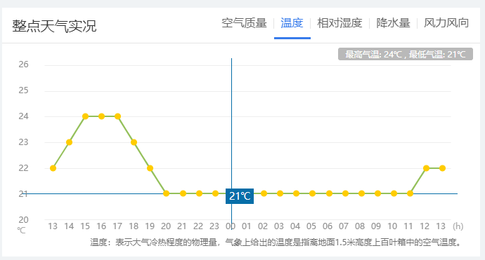
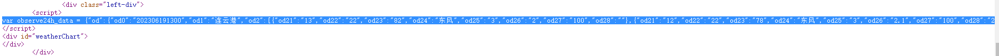
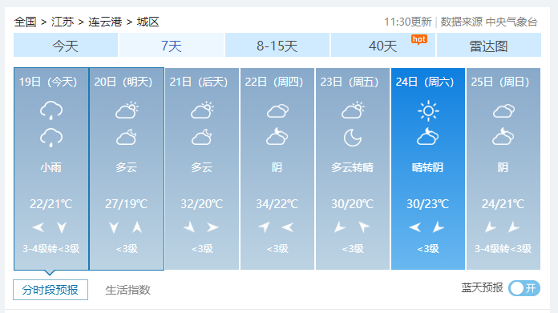
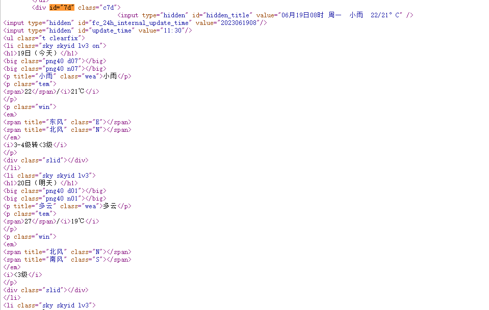
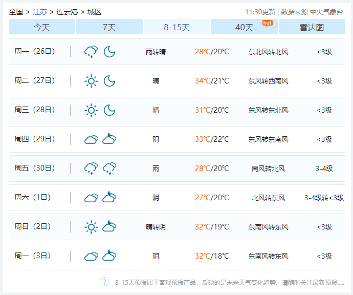
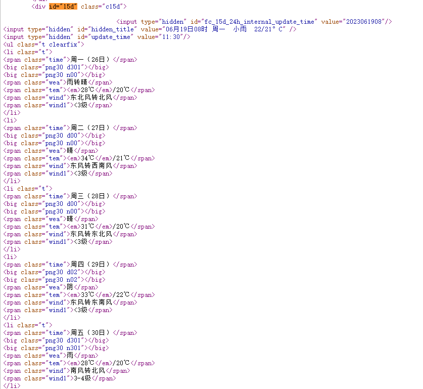

# webCrawler
 中国天气网天气数据爬虫

### 1. 数据获取

首先查看中国天气网的网址：http://www.weather.com.cn/weather/101280701.shtml这里就访问本地的天气网址，如果想爬取不同的地区只需修改最后的101280701地区编号即可，前面的weather代表是7天的网页，weather1d代表当天，weather15d代表未来14天。本次使用python中`requests`和`BeautifulSoup`库对中国天气网当天和未来14天的数据进行爬取，保存为csv文件。

这里就主要访问7天和14天的中国天气网。采用requests.get()方法，请求网页，如果成功访问，则得到的是网页的所有字符串文本。如果失败，则返回空字符串，下面是代码：

```python
def get_html_text(url):  # 请求获得网页内容
    try:
        r = requests.get(url, timeout=30)
        r.raise_for_status()
        r.encoding = r.apparent_encoding
        print("成功访问")
        return r.text
    except:
        print("访问错误")
        return " "
```


### 2. 分析并提取目标数据

#### 2.1 分析获取未来24小时天气数据

访问http://www.weather.com.cn/weather/101191001.shtml，可以看到该网页有连云港城区24小时的天气数据



右击查看网页源代码，发现信息 24小时的天气信息来自于以下列表



复制列表到JSON在线解析工具https://c.runoob.com/front-end/53/，格式化后得到如下数据

```json
[
  {
    "od21": "13",
    "od22": "22",
    "od23": "82",
    "od24": "东风",
    "od25": "3",
    "od26": "2",
    "od27": "100",
    "od28": ""
  },
  {
    "od21": "12",
    "od22": "22",
    "od23": "78",
    "od24": "东风",
    "od25": "3",
    "od26": "2.1",
    "od27": "100",
    "od28": "29"
  },
  # 共25个对象，中间21个对象的数据省略...
  {
    "od21": "14",
    "od22": "23",
    "od23": "94",
    "od24": "东风",
    "od25": "3",
    "od26": "0",
    "od27": "84",
    "od28": "31"
  },
  {
    "od21": "13",
    "od22": "22",
    "od23": "84",
    "od24": "东风",
    "od25": "3",
    "od26": "0.1",
    "od27": "92",
    "od28": "32"
  }
]
```

分析可知`od21`到`od28`分别是`时间`、`温度`、`风力方向`、`当前时刻风级`、`当前时刻降水量`、`相对湿度`、`空气质量`，下面是代码：需要注意的是源json数据的对象时间顺序是由远到进的，需要将转换后的final_day列表逆置`final_day = final_day[::-1]`，获得时间由进到远的对象列表。下面是代码实现：

```python
def get_content(html):  # 处理得到有用信息保存数据文件
    bs = BeautifulSoup(html, "html.parser")  # 创建BeautifulSoup对象
    body = bs.body
    
    # 下面爬取当天24小时的数据
	final_day = []  # 存放当天的数据
    data2 = body.find_all('div', {'class': 'left-div'})
    text = data2[2].find('script').string
    text = text[text.index('=') + 1:-2]  # 移除改var data=将其变为json数据
    jd = json.loads(text)
    dayone = jd['od']['od2']  # 找到当天的数据
    count = 0
    for i in dayone:
        temp = []
        if count <= 23:
            temp.append(i['od21'])  # 添加时间
            temp.append(i['od22'])  # 添加当前时刻温度
            temp.append(i['od24'])  # 添加当前时刻风力方向
            temp.append(i['od25'])  # 添加当前时刻风级
            temp.append(i['od26'])  # 添加当前时刻降水量
            temp.append(i['od27'])  # 添加当前时刻相对湿度
            temp.append(i['od28'])  # 添加当前时刻空气质量
            # print(temp)
            final_day.append(temp)
        count = count + 1
    final_day = final_day[::-1]  # 列表逆置
```


#### 2.2 获取未来7天天气数据

继续访问http://www.weather.com.cn/weather/101191001.shtml，可以看到该网页有连云港城区未来7天的天气数据



右击查看网页源代码



可以发现，7天的数据信息在div标签中并且id=“7d”，并且日期、天气、温度、风级等信息都在ul和li标签中，所以我们可以使用BeautifulSoup对获取的网页文本进行查找div标签id=“7d”，找出他包含的所有的ul和li标签，之后提取标签中相应的数据值，保存到对应列表中。需要注意的细节就是有时日期没有最高气温，对于没有数据的情况要进行判断和处理。另外对于一些数据保存的格式也要提前进行处理，比如温度后面的摄氏度符号，日期数字的提取，和风级文字的提取，这需要用到字符查找及字符串切片处理。下面是代码实现：

```python
def get_content(html):  # 处理得到有用信息保存数据文件
    bs = BeautifulSoup(html, "html.parser")  # 创建BeautifulSoup对象
    body = bs.body
    
    # 下面爬取7天的数据
    final = []  # 初始化一个列表保存数据
    data = body.find('div', {'id': '7d'})  # 找到div标签且id = 7d
    ul = data.find('ul')  # 找到所有的ul标签
    li = ul.find_all('li')  # 找到左右的li标签
    i = 0  # 控制爬取的天数
    for day in li:  # 遍历找到的每一个li
        if 7 > i > 0:
            temp = []  # 临时存放每天的数据
            date = day.find('h1').string  # 得到日期
            date = date[0:date.index('日')]  # 取出日期号
            temp.append(date)
            inf = day.find_all('p')  # 找出li下面的p标签,提取第一个p标签的值，即天气
            temp.append(inf[0].string)

            tem_low = inf[1].find('i').string  # 找到最低气温

            if inf[1].find('span') is None:  # 天气预报可能没有最高气温
                tem_high = None
            else:
                tem_high = inf[1].find('span').string  # 找到最高气温
            temp.append(tem_low[:-1])
            if tem_high[-1] == '℃':
                temp.append(tem_high[:-1])
            else:
                temp.append(tem_high)

            wind = inf[2].find_all('span')  # 找到风向
            for j in wind:
                temp.append(j['title'])

            wind_scale = inf[2].find('i').string  # 找到风级
            index1 = wind_scale.index('级')
            temp.append(int(wind_scale[index1 - 1:index1]))
            final.append(temp)
        i = i + 1
```


#### 2.3 获取未来8-14天天气数据，合并未来7天得到未来14天天气

访问http://www.weather.com.cn/weather15d/101191001.shtml，可以看到该网页有连云港城区未来8-14天的天气数据



右击查看网页源代码



可以发现，8-14天的数据信息在div标签中并且id=“15d”，其他处理和未来7天天气数据类似。下面是代码实现

```python
def get_content2(html):  # 处理得到有用信息保存数据文件
    bs = BeautifulSoup(html, "html.parser")  # 创建BeautifulSoup对象
    body = bs.body

    # 下面爬取8-14天的数据
    final = []  # 初始化一个列表保存数据
    data = body.find('div', {'id': '15d'})  # 找到div标签且id = 15d
    ul = data.find('ul')  # 找到所有的ul标签
    li = ul.find_all('li')  # 找到左右的li标签
    i = 0  # 控制爬取的天数
    for day in li:  # 遍历找到的每一个li
        if i < 8:
            temp = []  # 临时存放每天的数据
            date = day.find('span', {'class': 'time'}).string  # 得到日期
            date = date[date.index('（') + 1:-2]  # 取出日期号
            temp.append(date)
            weather = day.find('span', {'class': 'wea'}).string  # 找到天气
            temp.append(weather)
            tem = day.find('span', {'class': 'tem'}).text  # 找到温度
            temp.append(tem[tem.index('/') + 1:-1])  # 找到最低气温
            temp.append(tem[:tem.index('/') - 1])  # 找到最高气温
            wind = day.find('span', {'class': 'wind'}).string  # 找到风向
            if '转' in wind:  # 如果有风向变化
                temp.append(wind[:wind.index('转')])
                temp.append(wind[wind.index('转') + 1:])
            else:  # 如果没有风向变化，前后风向一致
                temp.append(wind)
                temp.append(wind)
            wind_scale = day.find('span', {'class': 'wind1'}).string  # 找到风级
            index1 = wind_scale.index('级')
            temp.append(int(wind_scale[index1 - 1:index1]))
            final.append(temp)
    return final
```

这样就得到了未来8-14天的天气数据，结合前面得到的未来7天数据，将两个列表合并就得到了未来14天的天气数据（这里合并在main函数里实现）


### 3. 将结果保存为csv文件

这里就是将爬来的天气数据保存为csv文件。代码实现如下

```python
def write_to_csv(file_name, data, day=14):  # 保存为csv文件
    with open(file_name, 'a', errors='ignore', newline='') as f:
        if day == 14:
            header = ['日期', '天气', '最低气温', '最高气温', '风向1', '风向2', '风级']
        else:
            header = ['小时', '温度', '风力方向', '风级', '降水量', '相对湿度', '空气质量']
        f_csv = csv.writer(f)
        f_csv.writerow(header)
        f_csv.writerows(data)
```


### 4. 附源码

依赖安装：

```shell
pip install requests BeautifulSoup4 -i http://pypi.douban.com/simple --trusted-host pypi.douban.com
```

源码地址：

https://github.com/Luminary-re/webCrawler01.git

